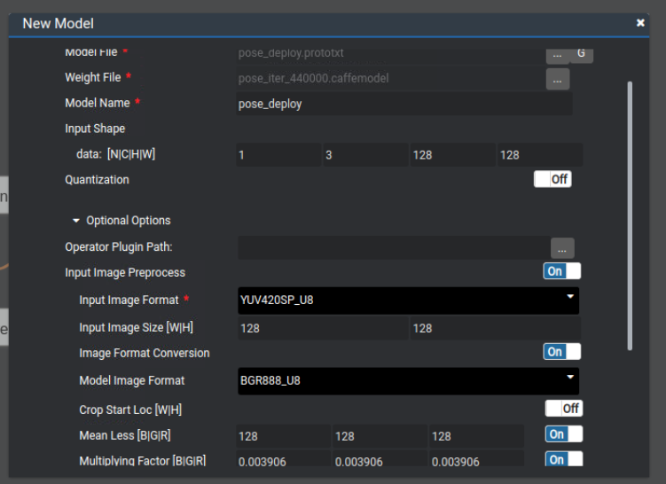
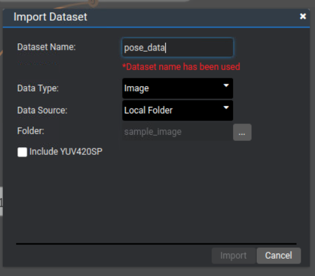
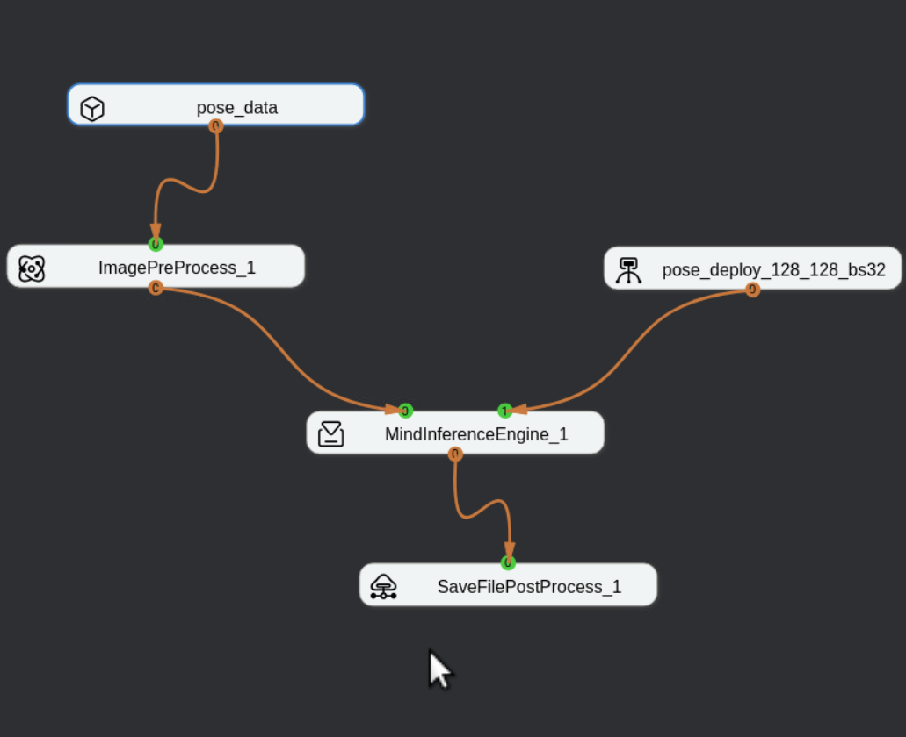

# Huawei-Ascend-Openpose

## Description

This is a repository for the implementation of CMU [openpose]() deep learning pose estimation framework on [Huawei Ascend Atlas 200 Dev Kit](). We treat Atlas 200DK as an AI acceleration card (NPU) which provide computation power for neural network inference.

We mainly use python to build up this pipeline which connects both PC part (client) and NPU part (client) by multi-processing, multi-threading and OpenSSH support. (put another way, this implementation is still very naive with great prospect to be improved 🐱‍👓)

This project is motivated by our interest and Huawei ICT innovation task. 

Hope it would inspire more developers to create something more interesting for Huawei Ascend DK.

####  Demo (pic2 is also processed via a 2D to 3D pose [projection](<https://github.com/miu200521358/3d-pose-baseline-vmd>)):

## Setup:

1. Profiling the Ascend 200DK, details can be seen [here](<https://www.huawei.com/minisite/ascend/cn/>)

2. Deploy OpenPose original [Caffe implementation](<https://github.com/ZheC/Realtime_Multi-Person_Pose_Estimation>) to Ascend 200DK.

   1. Import [pose_deploy.prototxt](https://github.com/ZheC/Realtime_Multi-Person_Pose_Estimation/blob/master/model/_trained_COCO/pose_deploy.prototxt) and corresponding [checkpoint](http://posefs1.perception.cs.cmu.edu/Users/ZheCao/pose_iter_440000.caffemodel) to 200DK via MindStudio software.

      

   2. Build computation graph for 200DK. 

      

      

   3. Generate and run testing.

3. Connect 200DK to PC, assign static IP to 200DK, then do the connection test via `ssh` connecting.

4. Run `demo.py`  or `demo_record_process.py` on your PC, then you can see the processed results. 

   Environments for PC:

   *  Python 3.6
   * OpenCV for video/webcam processing.
   * SciPy & NumPy for post data-processing on PC side.
   * Paramiko for SSH connection with Ascend Atlas200DK.
   * threading/multiprocessing for building multi-level data processing pipeline.

 **Note**,  we can also replace PC with a **Raspberry Pi 3** with specified Python environment.

----------------------

Wish you enjoy this project~

 